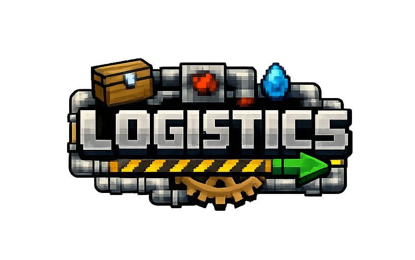

# Logistics: Automation

**A modern Minecraft logistics and pipe mod with authentic in-pipe item motion**

---

## ⚠️ Early Development

**Logistics is in active development.** Core pipe transport works, but expect rough edges, missing features, and the occasional bug. Report issues on [GitHub](https://github.com/indemnity83/logistics/issues) if something breaks.

---

## About

Logistics is a Fabric mod inspired by BuildCraft and Logistics Pipes, bringing authentic item pipe systems to modern Minecraft. Items travel smoothly through thin pipes with visible motion, integrating seamlessly with other mods via Fabric's Transfer API.

**Design Principles:**
- **Material-Based Identity** - Each pipe uses distinct vanilla materials for visual clarity
- **Layered Progression** - Three tiers: Mechanical pipes (basic operations), Smart pipes (decisions), Network logistics (abstract services)
- **Authentic Visuals** - Items travel continuously through pipes with visible speed
- **Mod Interoperability** - Works with any mod using Fabric Transfer API (ItemStorage)
- **Classic Ergonomics** - Simple placement, visible connections, easy to understand

---

## How It Works

Logistics is built on a **three-tier system** that grows with your world progression. Implemented tiers are listed first, followed by future plans.

### Tier 1: Mechanical Pipes (Implemented)
**Basic routing without item awareness**

Start here. These pipes perform mechanical operations—moving, merging, extracting, deleting—but they don't look at what's flowing through them. They just do their job, every time, regardless of item type.

- **Stone Transport Pipe (Stone)** - Very slow backbone connectivity with random routing
- **Copper Transport Pipe (Copper)** - Backbone connectivity with random routing
- **Item Extractor Pipe (Wood)** - Pull items from adjacent inventories into your network
- **Item Merger Pipe (Iron)** - All inputs converge to a single output
- **Golden Transport Pipe (Gold)** - Speed boost when powered by redstone
- **Item Passthrough Pipe (Sandstone)** - Connects only to pipes; bypasses inventories
- **Item Void Pipe (Obsidian)** - Delete unwanted items

### Tier 2: Smart Pipes (Implemented)
**Item-aware routing decisions**

These pipes are intelligent. They inspect items and change behavior based on what they see. This is where your network becomes conditional and responsive.

- **Item Filter Pipe (Diamond)** - Route specific items to specific destinations (item-aware)
- **Item Insertion Pipe (Quartz)** - Prefer inventories with space; otherwise route to pipes

### Tier 3: Network Logistics (Future)
**System-aware automation and requests**

The ultimate goal. Your inventories become abstract resources, and you request what you need—the network figures out the rest.

- **Request Tables** - Ask for items; the network delivers them
- **Provider Modules** - Advertise what inventories contain
- **Crafting Logistics** - Automated crafting on demand
- **Global Routing** - Smart pathfinding across your entire network

Each tier builds on the previous one—you'll use all three together as your base grows.

---

## Pipes & Tools

### Stone Transport Pipe (Stone)
Early transport pipe that moves items through your network at a very slow speed. When an item reaches a junction with multiple outputs, it randomly selects a direction. Pipes have a small internal capacity (about five items), so slow pipes can drop items if your early network gets too busy.

*Recipe: stone + glass → 8 pipes*

### Copper Transport Pipe (Copper)
Basic transport pipe that moves items through your network. When an item reaches a junction with multiple outputs, it randomly selects a direction. This is your backbone—simple, reliable connectivity.

*Recipe: copper ingot + glass → 8 pipes*

### Item Extractor Pipe (Wood)
Extraction pipe that actively pulls items from an adjacent inventor into your pipe network. Right-click with a wrench to select which face extracts. Only one face can be active at a time. Wooden pipes extract one item per operation.

*Recipe: planks + glass → 8 pipes*

### Item Merger Pipe (Iron)
Merger pipe that takes items from any input direction and routes them all to a single output direction. The output is indicated by an opaque connector. Right-click with a wrench to change the output direction. Items cannot enter through the output face.

*Recipe: iron ingot + glass → 8 pipes*

### Golden Transport Pipe (Gold)
Acceleration pipe that speeds up items when powered by redstone. Items passing through a powered gold pipe move faster than normal pipe transit speed.

*Recipe: gold ingot + glass → 8 pipes*

### Item Filter Pipe (Diamond)
Filter pipe that routes items based on configurable per-side filters. Right-click to open a GUI where you can set which item types go to which connected face. Items that don't match any filter are routed to unfiltered outputs. If an item matches no filters and there are no unfiltered directions, the item drops.

*Recipe: diamond + glass → 8 pipes*

### Item Insertion Pipe (Quartz)
Insertion pipe that routes items into connected inventories that will accept them; otherwise it continues them along the pipe network. Items drop if there are no valid outputs.

*Recipe: quartz + glass → 8 pipes*

### Item Passthrough Pipe (Sandstone)
Passthrough pipe that only connects to other pipes and never to inventories. Useful for bypassing inventories or forcing routing around storage.

*Recipe: sandstone + glass → 8 pipes*

### Item Void Pipe (Obsidian)
Deletion pipe that destroys any items that enter it. Items are deleted when they reach the center of the pipe, giving you time to react if needed. Useful for overflow management or disposing of unwanted items.

*Recipe: obsidian + glass + ender pearl → 8 pipes*

### Wrench
Configuration tool for pipes. Right-click to cycle output directions on iron pipes, select extraction faces on wooden pipes, open filter GUIs on diamond pipes, and interact with other configurable pipe types.

*Recipe: 4 iron ingots in wrench shape → 1 wrench*

---

## Installation

### Requirements
- Minecraft 1.21
- Fabric Loader 0.16.7+
- Fabric API
- Java 21+

### Steps
1. Install [Fabric Loader](https://fabricmc.net/use/) for Minecraft 1.21
2. Download [Fabric API](https://modrinth.com/mod/fabric-api)
3. Download Logistics from:
   - [GitHub Releases](https://github.com/indemnity83/logistics/releases) (includes dev builds)
   - [Modrinth](https://modrinth.com/mod/logistics) (stable releases)
   - [CurseForge](https://www.curseforge.com/minecraft/mc-mods/logistics) (stable releases)
4. Place the Fabric API and Logistics `.jar` files in your `.minecraft/mods` folder
5. Launch Minecraft with the Fabric profile

---

## Getting Started

1. **Craft Pipes** — Start with stone or copper pipes for basic transport
2. **Connect to Inventories** — Pipes automatically connect to adjacent chests and other inventories
3. **Extract Items** — Use Item Extractor Pipes to pull items from inventories (wrench to select face)
4. **Control Flow** — Item Merger Pipes for directional routing
5. **Filter Items** — Item Filter Pipes route specific items to specific destinations
6. **Speed Things Up** — Golden Transport Pipes accelerate items when powered by redstone

**Tips:**
- Items drop if they can't find a valid destination
- Use Void pipes to delete overflow or unwanted items
- Item Insertion Pipes prefer inventories with space and otherwise route to pipes
- All pipe tiers connect to each other—build complex networks by combining them
- The wrench is your friend

---

## Status

### ✅ Implemented
- Thin pipe blocks with 6-way connections
- Server-side traveling item simulation with continuous progress
- Client-side smooth visual rendering
- Extraction from and insertion into adjacent inventories
- Mechanical and Smart pipe behaviors

### 🚧 Future
- Request Table block with GUI
- Provider pipes that expose inventory contents
- Global pathfinding and request fulfillment
- Autocrafting support via vanilla Crafter integration
- Network logistics components
- Fluid pipes with Transfer API integration
- Power/cost system for logistics operations
- Additional pipe upgrades and advanced logistics features

See [`docs/DESIGN.md`](docs/DESIGN.md) for architecture details and technical design.

---

## Contributing

Contributions welcome! When reporting bugs:
- Use [GitHub Issues](https://github.com/indemnity83/logistics/issues)
- Include version info (Minecraft, Fabric Loader, mod version)
- Provide steps to reproduce
- Check existing issues first

For code contributions, see the development docs in `docs/`.

---

## License

This project is licensed under the MIT License - see the [LICENSE](LICENSE) file for details.

---

## Acknowledgments

Inspired by:
- **BuildCraft** — Classic pipe mechanics and visual style
- **Logistics Pipes** — Request/provider logistics system design
- The Fabric community for excellent modding tools and APIs

---

[Report an Issue](https://github.com/indemnity83/logistics/issues) • [Technical Design](docs/DESIGN.md) • [Pipe Behaviors](docs/PIPE_TYPES.md)

