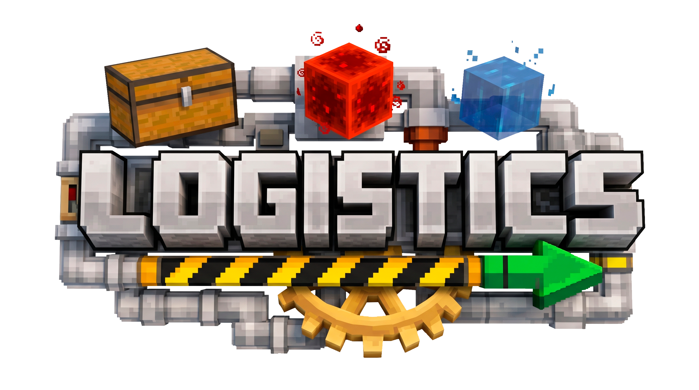

<div align="center">



# Logistics: Automation

**A modern Minecraft logistics and pipe mod with authentic in-pipe item motion**

[](https://github.com/indemnity83/logistics)
[](LICENSE)
[](https://codecov.io/gh/Indemnity83/logistics)
[](https://www.minecraft.net/)
[](https://fabricmc.net/)
[](https://discord.gg/94DP3CVNVt)

</div>


## ⚠️ Early Development

**Logistics is in active development.** Core pipe transport works, but expect rough edges, missing features, and the occasional bug. Report issues on [GitHub](https://github.com/indemnity83/logistics/issues) if something breaks, or [join the Discord](https://discord.gg/94DP3CVNVt) for help and discussion.


## About

Logistics is a Fabric mod inspired by BuildCraft and Logistics Pipes, bringing authentic item pipe systems to modern Minecraft. Items travel smoothly through thin pipes with visible motion, integrating seamlessly with other mods via Fabric's Transfer API.

**Design Principles:**
- **Material-Based Identity** - Each pipe uses distinct vanilla materials for visual clarity
- **Layered Progression** - Three tiers: Mechanical pipes (basic operations), Smart pipes (decisions), Network logistics (abstract services)
- **Authentic Visuals** - Items travel continuously through pipes with visible speed
- **Mod Interoperability** - Works with any mod using Fabric Transfer API (ItemStorage)
- **Classic Ergonomics** - Simple placement, visible connections, easy to understand


## How It Works

Logistics is built on a **three-tier system** that grows with your world progression.

### Tier 1: Mechanical Pipes (Implemented)
**Basic routing without item awareness**

Start here. These pipes perform mechanical operations—moving, merging, extracting, deleting—but they don't look at what's flowing through them. They just do their job, every time, regardless of item type.

- **Stone Transport Pipe (Stone)** - Very slow backbone connectivity with random routing
- **Copper Transport Pipe (Copper)** - Backbone connectivity with random routing
- **Item Extractor Pipe (Wood)** - Pull items from adjacent inventories into your network
- **Item Merger Pipe (Iron)** - All inputs converge to a single output
- **Golden Transport Pipe (Gold)** - Speed boost when powered by redstone
- **Item Passthrough Pipe (Sandstone)** - Connects only to pipes; bypasses inventories
- **Item Void Pipe (Obsidian)** - Delete unwanted items

### Tier 2: Smart Pipes (Implemented)
**Item-aware routing decisions**

These pipes are intelligent. They inspect items and change behavior based on what they see. This is where your network becomes conditional and responsive.

- **Item Filter Pipe (Diamond)** - Route specific items to specific destinations (item-aware)
- **Item Insertion Pipe (Quartz)** - Prefer inventories with space; otherwise route to pipes

### Tier 3: Network Logistics (Implemented)
**System-aware automation and requests**

Your inventories become abstract resources. Provider modules advertise what's available; supplier modules push stock; requester modules pull what's needed; crafting pipes handle on-demand autocrafting.

**Pipes:**
- **Basic Logistics Pipe** - Network backbone; accepts and deposits addressed items with optional filtering
- **Provider Logistics Pipe** - Advertises adjacent inventory contents to the network
- **Requester Logistics Pipe** - Requests specific items from the network on demand
- **Supplier Logistics Pipe** - Keeps a target inventory stocked with configured items
- **Crafting Logistics Pipe** - Automates crafting recipes fulfilled by the network
- **Process Logistics Pipe** - Routes in-progress crafting jobs to dedicated machines
- **Satellite Logistics Pipe** - Remote output point for routing items to distant destinations
- **Chassis Pipes (MkI–MkV)** - Modular pipes with swappable logistics module slots

**Modules (for Chassis Pipes):**
- **Provider Module (I–II)** - Advertise inventory contents at different range/speed tiers
- **Extractor Module (I–III)** - Pull items from adjacent inventories at increasing speeds
- **Passive / Active Supplier Module** - Push stock to requesters (passive waits; active seeks)
- **Crafter Module (I–III)** - Fulfill crafting requests at increasing speeds
- **Quicksort Module** - Route items by type to sorted destinations
- **Terminus Module** - Mark a pipe as a terminal endpoint; prevents routing past it
- **Sink Module** - Accept any overflow items
- **Polymorphic Sink Module** - Accept overflow, treating NBT-equal items as equivalent
- **Enchantment Sink Module** - Accept overflow, ignoring enchantment differences
- **Mod Sink Module** - Accept overflow filtered by mod origin

Each tier builds on the previous one—you'll use all three together as your base grows.


## Features

Logistics includes a complete system for item transport, power generation, and automation.

### Pipes
Transport items through networks with different behaviors:
- **Basic Transport** - Stone and Copper pipes for backbone connectivity
- **Extraction & Routing** - Wood (extractor), Iron (merger), Diamond (filter), Quartz (insertion) pipes
- **Special Pipes** - Gold (speed boost), Sandstone (passthrough), Obsidian (void)

[View all pipes →](https://indemnity83.github.io/logistics/pipes/)

### Power
RF energy generation and distribution:
- **Redstone Engine** - Simple, safe, steady power; never overheats
- **Stirling Engine** - Fuel-powered with heat management; shuts down safely on overheat
- **Creative Engine** - Infinite power for testing and creative mode
- **Power Cables (Copper/Gold/Ender)** - Distribute energy from engines to connected machines at increasing transfer rates

[Learn about power systems →](https://indemnity83.github.io/logistics/power/)

### Automation
- **[Macerator](https://indemnity83.github.io/logistics/automation/macerator/)** - Grind ores, gems, and materials into fine dusts for smelting and crafting
- **[Kiln](https://indemnity83.github.io/logistics/automation/kiln/)** - Electric furnace; smelts any vanilla smelting recipe using RF energy
- **[Laser Quarry](https://indemnity83.github.io/logistics/automation/laser-quarry/)** - Automated 16×16 mining with energy-scaled speed

### Tools
- **[Wrench](https://indemnity83.github.io/logistics/tools/wrench/)** - Configuration tool for pipes and machines
- **[Marking Fluid](https://indemnity83.github.io/logistics/tools/marking-fluid/)** - Color-code your pipe networks


## Installation

**Requirements:** Minecraft 1.21.11+ • Fabric Loader 0.18.6+ • Fabric API • Java 21+

**Download from:**
- [GitHub Releases](https://github.com/indemnity83/logistics/releases) (includes dev builds)
- [Modrinth](https://modrinth.com/mod/logistics) (stable releases)
- [CurseForge](https://www.curseforge.com/minecraft/mc-mods/logistics-automation) (stable releases)

[Full installation guide →](https://indemnity83.github.io/logistics/getting-started/install/)


## Quick Start

1. **Craft pipes** - Start with stone or copper transport pipes
2. **Connect to inventories** - Pipes automatically connect to chests and other storage
3. **Extract items** - Use wood extractor pipes (wrench to configure)
4. **Route and filter** - Combine different pipe types to build your network

[Build your first pipe network →](https://indemnity83.github.io/logistics/getting-started/first-network/)


## Status

### ✅ Implemented
- Thin pipe blocks with 6-way connections
- Server-side traveling item simulation with continuous progress
- Client-side smooth visual rendering
- Extraction from and insertion into adjacent inventories
- Mechanical and Smart pipe behaviors
- Network logistics: provider, requester, supplier, crafting, satellite, and chassis pipes
- Autocrafting via vanilla Crafter integration
- Redstone, Stirling, and Creative engines with heat management
- Power cables (copper, gold, ender) for RF energy distribution between machines
- Macerator for grinding ores, gems, and materials into dusts
- Kiln as an RF-powered electric furnace for any vanilla smelting recipe
- Laser Quarry with automatic frame construction and energy-scaled mining speed

### 🚧 In Progress
- NeoForge mod loader support (architecture groundwork complete; SPI implementations in progress)

### 🔮 Future
- Fluid pipes with Transfer API integration
- Power/cost system for logistics operations
- Additional pipe upgrades and advanced logistics features

See the [documentation](https://indemnity83.github.io/logistics/) for detailed information on pipes, power, automation, and more.


## Contributing

Contributions welcome! Report issues on [GitHub Issues](https://github.com/indemnity83/logistics/issues). For code contributions, see `CLAUDE.md` for development guidance.

### Pull request titles and changelogs

This project uses Conventional Commit-style pull request titles. Release notes are generated from PR titles, so titles should describe the player-visible impact whenever possible.

Format:

```text
type(scope): short description
```

Examples:

```text
feat(pipes): add priority routing mode
fix(neoforge): fix startup crash on NeoForge
perf(automation): reduce idle machine tick cost
refactor(common): simplify platform service lookup
test(pipes): add routing tests
build(fabric): update publishing task
ci(build): update Gradle cache settings
chore(release): update release metadata
chore(update): update dependencies
```

#### Changelog-visible types

These appear in player-facing release notes:

| Type | Changelog section | Use for |
|---|---|---|
| `feat` | Added | New player-visible behavior |
| `fix` | Fixed | Player-visible bug fixes |
| `perf` | Improved | Player-visible performance improvements |

#### Internal types

These are allowed for PR organization, but do not appear in release notes:

| Type | Use for |
|---|---|
| `refactor` | Code cleanup without player-visible behavior changes |
| `test` | Test coverage |
| `build` | Gradle, publishing, or build system changes |
| `ci` | GitHub Actions or automation changes |
| `chore` | Maintenance work |
| `docs` | Documentation-only changes |
| `revert` | Revert a previous change |

#### Allowed scopes

Use the scope that best describes the part of the mod affected:

| Scope | Use for |
|---|---|
| `core` | Shared mod behavior, base blocks/items, recipes, world behavior |
| `automation` | Machines, upgrades, automation logic |
| `pipes` | Pipes, routing, extraction, insertion, pipe networks |
| `energy` | Energy transfer and storage behavior |
| `storage` | Inventories, storage blocks, adapters |
| `ui` | Screens, tooltips, overlays, visible rendering/UX |
| `compat` | Integration with other mods |
| `fabric` | Fabric-specific user-visible behavior |
| `neoforge` | NeoForge-specific user-visible behavior |
| `docs` | README, wiki, or user documentation |
| `release` | Release metadata |
| `update` | Dependency and automated update PRs |
| `common` | Shared/internal code changes with no better user-facing scope |
| `build` | Build tooling or CI support scope |

Prefer player-facing scopes for `feat`, `fix`, and `perf`.

Good:

```text
fix(pipes): fix items getting stuck when a route becomes invalid
```

Avoid for player-facing changes:

```text
fix(common): invalidate pipe graph cache on neighbor update
```

The second title may be technically accurate, but the first produces better release notes.


## License

This project is licensed under the MIT License - see the [LICENSE](LICENSE) file for details.

Some textures are licensed under CC BY 4.0 or CC BY-NC-SA 4.0 - see [CREDITS.md](CREDITS.md) for attribution details.


## Acknowledgments

Inspired by:
- **BuildCraft** — Classic pipe mechanics and visual style
- **Logistics Pipes** — Request/provider logistics system design
- **Forestry** — machines and progressive automation
- The Fabric community for excellent modding tools and APIs

**Textures:**
- Some textures used, adapted, or inspired from [Unused Textures](https://github.com/malcolmriley/unused-textures) by Malcolm Riley, licensed under [CC BY 4.0](https://creativecommons.org/licenses/by/4.0/)
- Some textures used, adapted, or inspired from [TextureRepository](https://github.com/Futureazoo/TextureRepository) by Futureazoo, licensed under [CC BY-NC-SA 4.0](https://creativecommons.org/licenses/by-nc-sa/4.0/)


<div align="center">

[Report an Issue](https://github.com/indemnity83/logistics/issues) • [Documentation](https://indemnity83.github.io/logistics/) • [Discord](https://discord.gg/94DP3CVNVt)

</div>
