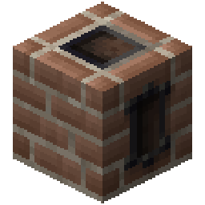
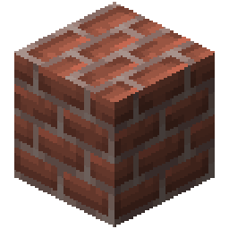

<div class="infobox">
    <div class="infobox-header">Kiln</div>
    <div class="infobox-image">
        
    </div>
    <table class="infobox-table">
        <tr>
            <td class="infobox-label">ID</td>
            <td class="infobox-value"><code>logistics:core/kiln</code></td>
        </tr>
        <tr>
            <td class="infobox-label">Type</td>
            <td class="infobox-value">Block (Machine)</td>
        </tr>
        <tr>
            <td class="infobox-label">Stackable</td>
            <td class="infobox-value"><span class="stackable-yes">Yes (64)</span></td>
        </tr>
        <tr>
            <td class="infobox-label">Function</td>
            <td class="infobox-value">Valve crafting</td>
        </tr>
        <tr>
            <td class="infobox-label">Fuel</td>
            <td class="infobox-value">Coal/Blaze Rod/Lava</td>
        </tr>
        <tr>
            <td class="infobox-label">Added</td>
            <td class="infobox-value">v0.2.0</td>
        </tr>
    </table>
</div>

# Kiln

The **Kiln** is a temperature-controlled crafting machine that produces [valves](../materials/index.md#valves) using glass and metal. It uses an energy-based heating system with fuel progression - more advanced valves require hotter temperatures and better fuels.

## Recipe

<div class="crafting-recipe">
    <div class="crafting-grid">
        <div class="crafting-slot"></div>
        <div class="crafting-slot"></div>
        <div class="crafting-slot"></div>
        <div class="crafting-slot"></div>
        <div class="crafting-slot"></div>
        <div class="crafting-slot"></div>
        <div class="crafting-slot"></div>
        <div class="crafting-slot"></div>
        <div class="crafting-slot"></div>
    </div>
    <div class="crafting-arrow">→</div>
    <div class="crafting-output">
        
    </div>
</div>

**Yields:** 1× Kiln

## How It Works

The Kiln operates on a **temperature and energy system**:

1. **Add fuel** - Coal, lava buckets, blaze rods, etc.
2. **Temperature rises** - Fuel burns and heats the kiln
3. **Craft valves** - Place materials and glass/sand in crafting pattern
4. **Glass melts** - Kiln melts glass internally during crafting
5. **Energy consumption** - Recipes consume energy over time
6. **Maintain temperature** - Better fuels sustain higher energy recipes

**Key mechanics:**
- Temperature derived from internal energy
- Recipes require minimum temperature (1200°C)
- Different fuels burn at different rates
- Advanced recipes need premium fuels to maintain temperature

## Using the Kiln

### Basic Operation

1. **Place kiln** in your workshop
2. **Right-click** to open GUI
3. **Add fuel** to fuel slot (bottom left)
4. **Wait for heating** - temperature rises to operating point (1500°C)
5. **Place pattern** - Arrange metal + redstone in crafting grid
6. **Add glass/sand** - Kiln melts it internally (1 block → 1000mb → 4 recipes)
7. **Crafting begins** - Progress bar shows completion (uses 250mb molten glass)
8. **Collect output** - Valves appear in output slot

### Fuel Requirements

Different valve tiers require different fuel quality:

**Tier 1 (Coal sufficient):**
- [Copper Valve](../materials/valve-copper.md) - 40 energy/tick
- [Tin Valve](../materials/valve-tin.md) - 60 energy/tick

**Tier 2 (Coal at limit):**
- [Iron Valve](../materials/valve-iron.md) - 100 energy/tick
- [Bronze Valve](../materials/valve-bronze.md) - 140 energy/tick

**Tier 3 (Blaze rod/lava needed):**
- [Gold Valve](../materials/valve-gold.md) - 180 energy/tick
- [Apatite Valve](../materials/valve-apatite.md) - 200 energy/tick

**Tier 4+ (Lava recommended):**
- [Diamond Valve](../materials/valve-diamond.md) - 240 energy/tick
- [Emerald Valve](../materials/valve-emerald.md) - 280 energy/tick
- [Netherite Valve](../materials/valve-netherite.md) - 400 energy/tick
- [Blazing Valve](../materials/valve-blazing.md) - 440 energy/tick (maximum)

### Fuel Types

**Wood/Planks:**
- Burns fast, low energy output
- **Cannot sustain** valve recipes (too weak)

**Coal:**
- Standard fuel for early valves
- Works for copper, tin, iron
- **Struggles** with bronze (140 energy/tick)
- **Fails** at higher tiers

**Blaze Rods:**
- Mid-tier fuel
- Sustains gold, apatite valves
- Still insufficient for highest tiers

**Lava Buckets:**
- Premium fuel source
- Required for diamond, emerald, netherite valves
- Maximum burn rate ~75 energy/tick net capacity
- **Barely sustains** blazing valve (440 demand vs ~315 capacity)

## Temperature Behavior

**Operating setpoint:** 1500°C
**Crafting minimum:** 1200°C
**Maximum theoretical:** 2000°C

**What happens:**
- Fuel burns → energy increases → temperature rises
- Recipe active → energy drains → temperature may drop
- If temperature falls below 1200°C → crafting pauses
- Add better fuel → temperature recovers → crafting resumes

**Natural progression:**
- Low-tier recipes work with any fuel (just slower)
- High-tier recipes **require** premium fuels or they stall

## Glass Requirements

All valve recipes require **250mb of molten glass**.

**Using glass:**
- Add glass blocks or sand directly to the kiln
- Each block produces 1 bucket (1000mb) of molten glass when melted
- One glass block = enough for 4 valve recipes
- Kiln melts it internally during crafting
- No external smelting or fluid infrastructure needed

## Tips

- Start with coal for copper/tin valves
- Upgrade to lava buckets for advanced valves
- Watch temperature gauge - if it drops, crafting pauses
- Better fuels = faster, uninterrupted crafting
- Keep spare fuel on hand for continuous operation
- Stock glass blocks or sand for valve crafting

## Common Patterns

**Early kiln setup:**
```
[Kiln] + Coal → [Copper/Tin Valves]
```

**Advanced setup:**
```
[Kiln] + Lava Bucket → [Diamond/Emerald/Netherite Valves]
```

**With glass storage:**
```
[Sand/Glass blocks] → [Kiln] → [Valves]
```

## Troubleshooting

**Crafting paused/temperature dropping:**
- Fuel is insufficient for recipe energy demand
- Upgrade to better fuel (coal → blaze rod → lava)
- Low-tier recipes will complete eventually, just slowly

**No glass available:**
- Need glass blocks or sand to start crafting
- Add glass/sand directly to the kiln GUI
- No pre-smelting required

**Pattern not accepted:**
- Check recipe pattern (materials + redstone configuration)
- Ensure glass/sand is available
- Verify minimum temperature reached (1200°C)

## See Also
- [Valves](../materials/index.md#valves) - All 13 valve types
- [Copper Valve](../materials/valve-copper.md) - Easiest starter valve
- [Blazing Valve](../materials/valve-blazing.md) - Highest energy demand
- [Materials](../materials/index.md) - Crafting components
