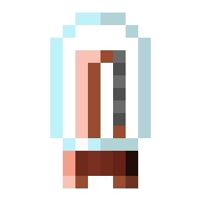
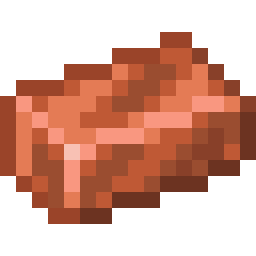

    
Copper Valve

    

        
    

    <table class="infobox-table">
        <tr>
            <td class="infobox-label">ID</td>
            <td class="infobox-value"><code>logistics:core/valve_copper</code></td>
        </tr>
        <tr>
            <td class="infobox-label">Type</td>
            <td class="infobox-value">Item</td>
        </tr>
        <tr>
            <td class="infobox-label">Stackable</td>
            <td class="infobox-value">Yes (64)</td>
        </tr>
        <tr>
            <td class="infobox-label">Kiln Tier</td>
            <td class="infobox-value">Tier 1</td>
        </tr>
        <tr>
            <td class="infobox-label">Added</td>
            <td class="infobox-value">v0.2.0</td>
        </tr>
    </table>

# Copper Valve

The **Copper Valve** is a Tier 1 valve crafted in the [Kiln](../automation/kiln.md). It's the easiest valve to produce, requiring only coal as fuel.

## Recipe

    

        

        

        

        

        

        

        

        

        

    

    
→

    

        
        4
    

**[Kiln](../automation/kiln.md) crafting:**
- 5× Copper Ingot + 2× Redstone + 250mb Molten Glass
- **Process time:** 100 ticks
- **Energy demand:** 40 energy/tick
- **Yields:** 4× Copper Valve

## Fuel Requirements

**Tier 1 - Coal sufficient**

Energy demand: 40 energy/tick
- **Wood:** Fails (too weak, ~4 energy/tick)
- **Coal:** Works well (~15-20 energy/tick with PID burst)
- **Blaze Rod:** Overkill but works
- **Lava Bucket:** Overkill but works

Coal is the recommended minimum fuel for copper valves.

## Usage

Valves are currently crafting components for future features. Stock up on various valve types as you progress through fuel tiers.

## Tips

- Easiest valve to craft - good for learning the Kiln
- Coal is sufficient - no need for premium fuels
- Yields 4 valves per craft
- Molten glass required - set up glass smelting first

## See Also
- [Kiln](../automation/kiln.md) - Temperature-based crafting machine
- [Tin Valve](valve-tin.md) - Next tier up (60 energy/tick)
- [Valves](index.md#valves) - All valve types
