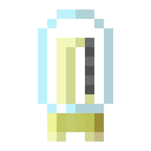
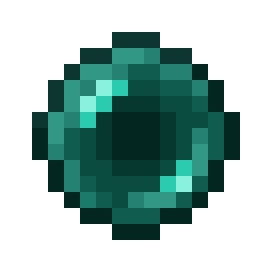
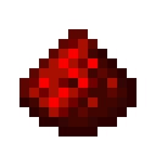

    
Ender Valve

    

        
    

    <table class="infobox-table">
        <tr>
            <td class="infobox-label">ID</td>
            <td class="infobox-value"><code>logistics:core/valve_ender</code></td>
        </tr>
        <tr>
            <td class="infobox-label">Type</td>
            <td class="infobox-value">Item</td>
        </tr>
        <tr>
            <td class="infobox-label">Stackable</td>
            <td class="infobox-value">Yes (64)</td>
        </tr>
        <tr>
            <td class="infobox-label">Kiln Tier</td>
            <td class="infobox-value">Tier 4</td>
        </tr>
        <tr>
            <td class="infobox-label">Added</td>
            <td class="infobox-value">v0.2.0</td>
        </tr>
    </table>

# Ender Valve

The **Ender Valve** is a Tier 4 valve crafted in the [Kiln](../automation/kiln.md). It requires ender pearls and lava bucket fuel.

## Recipe

    

        

        

        

        

        

        

        

        

        

    

    
→

    

        
        4
    

**[Kiln](../automation/kiln.md) crafting:**
- 5× Ender Pearl + 2× Redstone + 250mb Molten Glass
- **Process time:** 260 ticks
- **Energy demand:** 260 energy/tick
- **Yields:** 4× Ender Valve

## Fuel Requirements

**Tier 4 - Lava recommended**

Energy demand: 260 energy/tick
- **Blaze Rod:** **Fails**
- **Lava Bucket:** Recommended

Lava buckets required.

## Usage

Valves are crafting components for future features. Ender valves require ender pearl farming.

## Tips

- Requires 5 ender pearls per craft
- Lava buckets necessary
- Longest process time in Tier 4 (260 ticks)
- Stock up on ender pearls first

## See Also
- [Kiln](../automation/kiln.md) - Crafting machine
- [Diamond Valve](valve-diamond.md) - Same tier (240 energy/tick)
- [Emerald Valve](valve-emerald.md) - Next tier (280 energy/tick)
