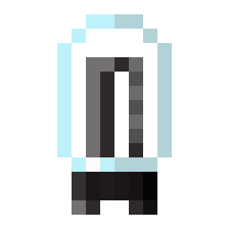
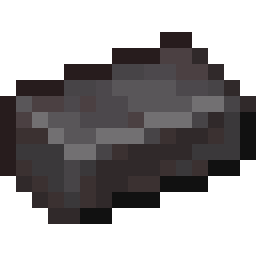

    
Netherite Valve

    

        
    

    <table class="infobox-table">
        <tr>
            <td class="infobox-label">ID</td>
            <td class="infobox-value"><code>logistics:core/valve_netherite</code></td>
        </tr>
        <tr>
            <td class="infobox-label">Type</td>
            <td class="infobox-value">Item</td>
        </tr>
        <tr>
            <td class="infobox-label">Stackable</td>
            <td class="infobox-value">Yes (64)</td>
        </tr>
        <tr>
            <td class="infobox-label">Kiln Tier</td>
            <td class="infobox-value">Tier 6</td>
        </tr>
        <tr>
            <td class="infobox-label">Added</td>
            <td class="infobox-value">v0.2.0</td>
        </tr>
    </table>

# Netherite Valve

The **Netherite Valve** is a Tier 6 valve crafted in the [Kiln](../automation/kiln.md). It has near-maximum energy demand far exceeding lava capacity.

## Recipe

    

        

        

        

        

        

        

        

        

        

    

    
→

    

        
        4
    

**[Kiln](../automation/kiln.md) crafting:**
- 5× Netherite Ingot + 2× Redstone + 250mb Molten Glass
- **Process time:** 280 ticks
- **Energy demand:** 400 energy/tick
- **Yields:** 4× Netherite Valve

## Fuel Requirements

**Tier 6 - Lava insufficient**

Energy demand: 400 energy/tick
- **Lava Bucket:** **Cannot sustain** (~315 capacity vs 400 demand)

Lava buckets fail significantly. Temperature drops repeatedly.

## Usage

Valves are crafting components for future features. Netherite valves require extreme patience with current fuels.

## Tips

- Requires 5 netherite ingots - extremely expensive
- Lava insufficient - heavy temperature drops
- Will complete eventually through pause/resume cycles
- Most expensive valve (netherite cost)
- Second-highest energy demand (400)

## See Also
- [Kiln](../automation/kiln.md) - Crafting machine
- [Obsidian Valve](valve-obsidian.md) - Previous tier (360 energy/tick)
- [Blazing Valve](valve-blazing.md) - Maximum tier (440 energy/tick)
