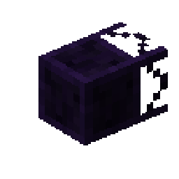
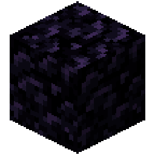

<div class="infobox">
    <div class="infobox-header">Item Void Pipe</div>
    <div class="infobox-image">
        
    </div>
    <table class="infobox-table">
        <tr>
            <td class="infobox-label">ID</td>
            <td class="infobox-value"><code>logistics:pipe/item_void_pipe</code></td>
        </tr>
        <tr>
            <td class="infobox-label">Type</td>
            <td class="infobox-value">Block (Pipe)</td>
        </tr>
        <tr>
            <td class="infobox-label">Stackable</td>
            <td class="infobox-value"><span class="stackable-yes">Yes (64)</span></td>
        </tr>
        <tr>
            <td class="infobox-label">Tier</td>
            <td class="infobox-value"><span class="infobox-tier infobox-tier-1">Tier 1 - Mechanical</span></td>
        </tr>
        <tr>
            <td class="infobox-label">Added</td>
            <td class="infobox-value">v0.1.0</td>
        </tr>
    </table>
</div>

# Item Void Pipe

The **Item Void Pipe** is a [Tier 1](../core/tier-system.md) mechanical pipe that destroys any items that enter it. Use it for overflow management or disposing of unwanted items.

## Recipe

<div class="crafting-recipe">
    <div class="crafting-grid">
        <div class="crafting-slot"></div>
        <div class="crafting-slot"></div>
        <div class="crafting-slot"></div>
        <div class="crafting-slot"></div>
        <div class="crafting-slot"></div>
        <div class="crafting-slot"></div>
        <div class="crafting-slot"></div>
        <div class="crafting-slot"></div>
        <div class="crafting-slot"></div>
    </div>
    <div class="crafting-arrow">→</div>
    <div class="crafting-output">
        
        <span class="crafting-count">8</span>
    </div>
</div>

**Yields:** 8× Item Void Pipe

## Behavior

Item Void Pipes permanently delete items. When an item reaches the center of the pipe, it's destroyed - no drops, no recovery.

**Key features:**
- Deletes items at pipe center
- Items visible briefly before deletion (time to react if needed)
- No item recovery once deleted
- Connects to all pipe types
- Prevents item drops from overflowing systems

## Deletion Timing

Items are deleted when they reach the **center** of the void pipe. You can see them travel partway into the pipe before disappearing, giving you a brief window to react if items are being voided unintentionally.

## Tips

- Use for overflow management in storage systems
- Delete unwanted byproducts from automation
- Prevent item drops from full inventories
- Place at end of overflow branches
- Combine with [Item Filter Pipes](item-filter-pipe.md) to void specific items
- No recovery possible - use carefully
- More expensive than other basic pipes (requires ender pearl)

## Common Patterns

**Overflow protection:**
```
[Source] → [Item Insertion Pipe] → [Storage]
                    ↓
              [Item Void Pipe] (catches overflow when storage full)
```

**Filtered voiding:**
```
[Source] → [Item Filter Pipe] → [Cobblestone] → [Item Void Pipe]
                    ↓
              [Wanted items] → [Storage]
```

**Guaranteed item disposal:**
```
[Unwanted items] → [Item Void Pipe] (no drops, clean deletion)
```

## See Also
- [Item Filter Pipe](item-filter-pipe.md) - Route specific items to void
- [Item Insertion Pipe](item-insertion-pipe.md) - Route overflow to void
- [Item Transport](../core/item-transport.md) - Item lifecycle
- [Routing](../core/routing.md) - Directing items to void
