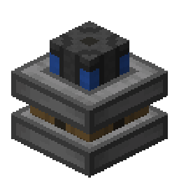
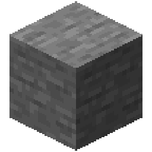
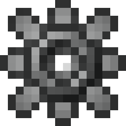
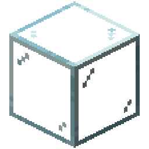
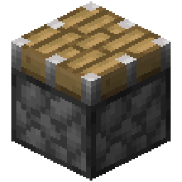

    
Stirling Engine

    

        
    

    <table class="infobox-table">
        <tr>
            <td class="infobox-label">ID</td>
            <td class="infobox-value"><code>logistics:power/stirling_engine</code></td>
        </tr>
        <tr>
            <td class="infobox-label">Type</td>
            <td class="infobox-value">Block (Engine)</td>
        </tr>
        <tr>
            <td class="infobox-label">Stackable</td>
            <td class="infobox-value">No</td>
        </tr>
        <tr>
            <td class="infobox-label">Function</td>
            <td class="infobox-value">RF Generation</td>
        </tr>
        <tr>
            <td class="infobox-label">Fuel</td>
            <td class="infobox-value">Coal/Wood/Lava</td>
        </tr>
        <tr>
            <td class="infobox-label">Output</td>
            <td class="infobox-value">High RF</td>
        </tr>
        <tr>
            <td class="infobox-label">Added</td>
            <td class="infobox-value">v0.1.0</td>
        </tr>
    </table>

# Stirling Engine

The **Stirling Engine** is a high-power generator that burns fuel to produce substantial RF energy. It can overheat if run continuously without cooling, requiring careful management.

## Recipe

    

        

        

        

        

        

        

        

        

        

    

    
→

    

        
    

**Yields:** 1× Stirling Engine

## Behavior

The Stirling Engine burns fuel (coal, charcoal, wood, lava buckets, etc.) to generate RF energy. It requires both fuel and a redstone signal to operate. Temperature rises with use - if the engine overheats, it shuts down until reset.

**Key features:**
- Burns fuel for substantial power output
- Requires redstone signal to run
- Temperature management - can overheat
- Output face configurable with [Wrench](../tools/wrench.md)
- Fuel GUI for loading fuel
- Much more powerful than [Redstone Engine](redstone-engine.md)

## Operation

1. Place engine next to machine
2. Use [Wrench](../tools/wrench.md) to rotate output face toward machine
3. Right-click to open fuel GUI
4. Add fuel (coal, charcoal, wood, lava bucket, etc.)
5. Apply redstone signal
6. Engine runs, consuming fuel and generating RF

## Fuel Management

Right-click the engine to open the fuel GUI:
- Add burnable items (coal, charcoal, wood planks, lava buckets)
- Fuel burns while engine is powered by redstone
- More fuel types accepted than vanilla furnace
- Lava buckets provide long burn time

## Temperature and Overheating

The engine heats up during operation:
- **Temperature rises** while running
- **Overheat threshold** - engine shuts down if too hot
- **Cooldown required** - wait for temperature to drop
- **Reset with wrench** - right-click overheated engine with wrench to reset

**To prevent overheating:**
- Run in intervals (not continuously)
- Turn off redstone signal periodically
- Monitor temperature visually (if indicator present)
- Use multiple engines in rotation

## Configuration

Use a [Wrench](../tools/wrench.md) to:
- **Rotate output face** - cycle through directions
- **Reset overheat** - right-click overheated engine to reset

## Power Output

Stirling Engines produce **high RF output** suitable for:
- [Laser Quarry](../automation/laser-quarry.md) - recommended power source
- High-throughput machines
- Fast operation speeds

Substantially more powerful than [Redstone Engine](redstone-engine.md).

## Tips

- Best power source for [Laser Quarry](../automation/laser-quarry.md)
- Keep fuel stocked for continuous operation
- Watch for overheating - shut off redstone if needed
- Multiple engines can power one machine
- Requires both fuel AND redstone signal
- More expensive than redstone engine but much more capable

## See Also
- [RF Energy](rf-energy.md) - Understanding the power system
- [Redstone Engine](redstone-engine.md) - Low-power alternative
- [Laser Quarry](../automation/laser-quarry.md) - Major power consumer
- [Wrench](../tools/wrench.md) - Configuration and overheat reset
- [Stone Gear](../materials/stone-gear.md) - Crafting component
