<div class="infobox">
    <div class="infobox-header">Marking Fluid</div>
    <div class="infobox-image">
        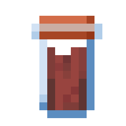
    </div>
    <table class="infobox-table">
        <tr>
            <td class="infobox-label">ID</td>
            <td class="infobox-value"><code>logistics:tool/marking_fluid</code></td>
        </tr>
        <tr>
            <td class="infobox-label">Type</td>
            <td class="infobox-value">Tool</td>
        </tr>
        <tr>
            <td class="infobox-label">Stackable</td>
            <td class="infobox-value"><span class="stackable-yes">Yes (64)</span></td>
        </tr>
        <tr>
            <td class="infobox-label">Function</td>
            <td class="infobox-value">Pipe color-coding</td>
        </tr>
        <tr>
            <td class="infobox-label">Added</td>
            <td class="infobox-value">v0.1.0</td>
        </tr>
    </table>
</div>

# Marking Fluid

**Marking Fluid** is a color-coding tool that prevents [Copper Transport Pipes](../pipes/copper-transport-pipe.md) from connecting to each other. Use it to segment networks and run multiple independent pipe systems side-by-side.

## Recipe

<div class="crafting-recipe">
    <div class="crafting-grid">
        <div class="crafting-slot"></div>
        <div class="crafting-slot"></div>
        <div class="crafting-slot"></div>
        <div class="crafting-slot"></div>
        <div class="crafting-slot">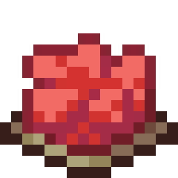</div>
        <div class="crafting-slot"></div>
        <div class="crafting-slot"></div>
        <div class="crafting-slot"></div>
        <div class="crafting-slot"></div>
    </div>
    <div class="crafting-arrow">→</div>
    <div class="crafting-output">
        
    </div>
</div>

**Shapeless crafting:** Water Bottle + Dye (any color) = Marking Fluid (colored)

## Available Colors

Marking fluid comes in all 16 Minecraft dye colors:

<div style="display: grid; grid-template-columns: repeat(4, 1fr); gap: 10px; margin: 20px 0;">
    <div style="text-align: center;">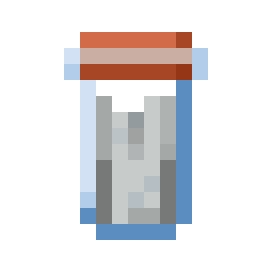<br>White</div>
    <div style="text-align: center;">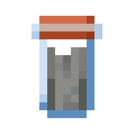<br>Light Gray</div>
    <div style="text-align: center;">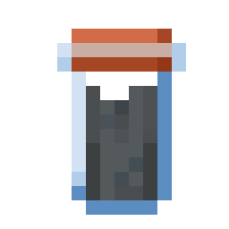<br>Gray</div>
    <div style="text-align: center;">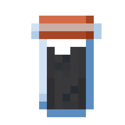<br>Black</div>
    <div style="text-align: center;"><br>Red</div>
    <div style="text-align: center;">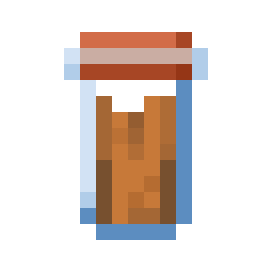<br>Orange</div>
    <div style="text-align: center;">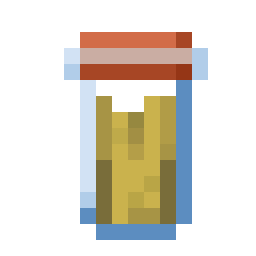<br>Yellow</div>
    <div style="text-align: center;"><br>Lime</div>
    <div style="text-align: center;">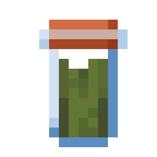<br>Green</div>
    <div style="text-align: center;">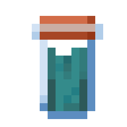<br>Cyan</div>
    <div style="text-align: center;">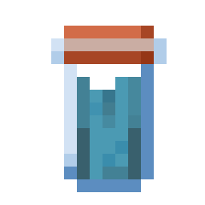<br>Light Blue</div>
    <div style="text-align: center;">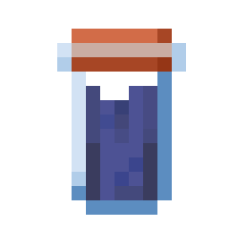<br>Blue</div>
    <div style="text-align: center;">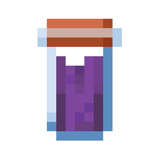<br>Purple</div>
    <div style="text-align: center;">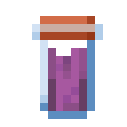<br>Magenta</div>
    <div style="text-align: center;">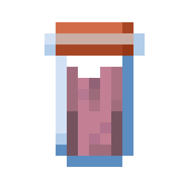<br>Pink</div>
    <div style="text-align: center;">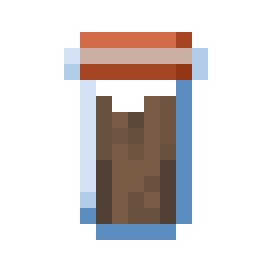<br>Brown</div>
</div>

## Usage

Right-click [Copper Transport Pipes](../pipes/copper-transport-pipe.md) with marking fluid to color-code them:

1. Craft marking fluid with desired dye color
2. Right-click copper pipe with marking fluid
3. Pipe takes on the dye color
4. **Pipes will only connect to other pipes of the same color**
5. Different colored pipes will not connect to each other
6. Unmarked pipes connect to all colors

## Removing Marking

To clear a pipe's color marking:
- Sneak + right-click with empty hand
- Pipe returns to unmarked state
- Can now connect to any pipe

## Connection Rules

**Same color pipes:**
- **Connect to each other**
- Form isolated networks by color

**Different color pipes:**
- **Do not connect** to each other
- Keeps colored networks separate

**Unmarked pipes:**
- **Connect to all pipes** regardless of color
- Can bridge between different colored networks

## Use Cases

**Run parallel networks:**
```
[Red pipes] ═══ [Red network A] (red only connects to red)
[Blue pipes] ══ [Blue network B] (blue only connects to blue)
    (Red and blue networks remain separate)
```

**Isolate same-colored networks:**
```
[Green network A] → [Green pipes only]

[Green network B] → [Green pipes only]
    (Two separate green networks won't merge)
```

**Organize complex builds:**
```
Different colored pipes for different purposes:
- Red = ore processing
- Blue = item sorting
- Green = overflow management
```

## Tips

- Only works on [Copper Transport Pipes](../pipes/copper-transport-pipe.md)
- Each dye creates a different color
- Sneak + empty hand to remove marking
- Visual indicator shows pipe color
- Alternative to physical separation
- Cleaner than using blocks to separate networks
- Different from filters - this prevents physical connections

## See Also
- [Copper Transport Pipe](../pipes/copper-transport-pipe.md) - Pipe type that accepts marking
- [Connectivity](../core/connectivity.md) - Connection rules
- [Pipe Networks](../core/pipe-networks.md) - Network segmentation
- [Item Passthrough Pipe](../pipes/item-passthrough-pipe.md) - Alternative segmentation method
